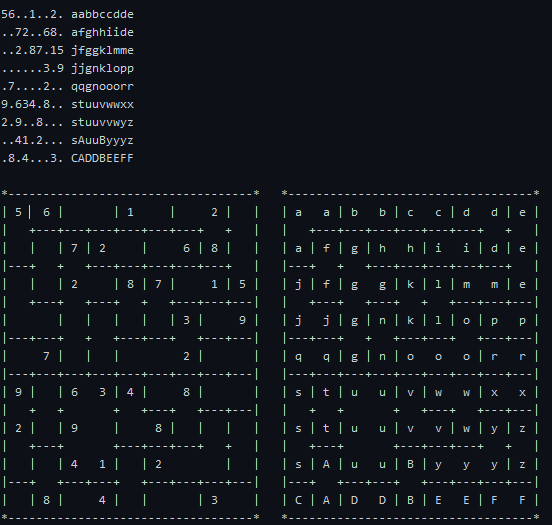

# killer-Sudoku-- game -> odaxav -- solver -> me  --  
Objectif  
You may know the sudoku puzzle. Killer sudoku adds a new rule with cages. A cage is a group of cells, the sum of which must equal the cage value. Numbers cannot repeat within cages.  

Here are the 4 rules of killer sudoku:  
1. Each row must have numbers from 1 to 9 with no repetition  
2. Each column must have numbers from 1 to 9 with no repetition  
3. Each region (3x3 square) must have numbers from 1 to 9 with no repetition  
4. Each cage's cell numbers must sum to the cage value, with no repetition among numbers  
  
The cages are represented in a 9x9 grid with an identifier from a to z and A to Z as follows (first test case):  
  

